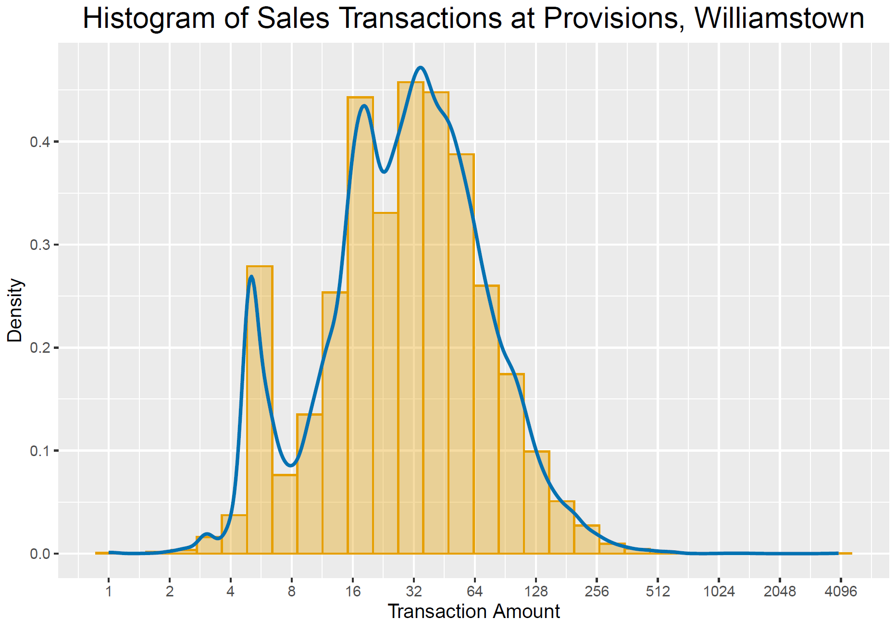

# 2 Data Visualization

 

## Readings  

_These are useful references as opposed to required readings._

[Fundamentalso fo Data Visualization]([https://r4ds.hadley.nz/](https://clauswilke.com/dataviz/index.html))  

[A Very Old Development Impact Blog Post Where David McKenzie Talks About Graphing Treatment Effects](https://blogs.worldbank.org/en/impactevaluations/tools-trade-graphing-impacts-standard-error-bars)  

 

## Lecture 

[Slides from Lecture 3](https://pjakiela.github.io/ECON370/ECON370-L3-data-viz-2024-09-16.pdf)

 

## Lab  

Objective:  conduct exploratory data analysis of transaction-level data from Provisions Williamstown.  After loading and cleaning the 
transactions data, you will create a summary statistics table, a histogram of transaction amounts, a histogram of daily/weekly/monthly sales or revenues, 
and a scatter plot.  Details are contained in the R/Python code template [ECON370-lab2.txt](ECON370-lab2.txt).  

You will upload a finished summary statistics table that is either a pdf produced using latex or an html file.  A latex template is available [here](ECON370-table-template.tex), and an html template is available [here](ECON370-html-table-template.txt).  You can compile the latex template using overleaf or your favorite latex editor.  

As part of the lab, you will be asked to replicate the following graph:  

  

When you finish the lab, you can upload it [here](https://www.gradescope.com/courses/854937/assignments/4954480/).  
