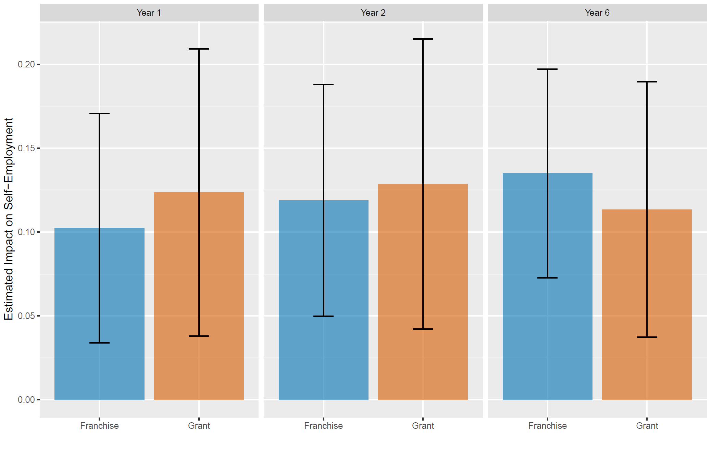

# 3 Data Visualization

 

## Readings  

_These are useful references as opposed to required readings._

[Fundamentals of Data Visualization](https://clauswilke.com/dataviz/index.html)  

[A Very Old Development Impact Blog Post Where David McKenzie Talks About Graphing Treatment Effects](https://blogs.worldbank.org/en/impactevaluations/tools-trade-graphing-impacts-standard-error-bars)  

 

## Lecture 

[Slides from Lecture 3](https://pjakiela.github.io/ECON370/ECON370-L3-data-viz-2024-09-16.pdf)

 

## Lab  

Objective:  for this lab, you will be using the [replication files](https://dataverse.harvard.edu/file.xhtml?fileId=10361258&version=1.0) from my paper [A Firm of One’s Own: Experimental Evidence On Credit Constraints and Occupational Choice](https://pjakiela.github.io/research/BHIJO-REStat-2024-05-24.pdf).  The paper describes the results of a randomized trial evaluating the impact of a program intended to help young women in Nairobi become small-scale entrepreneurs.  You can read a short article summarizing our study [here](https://voxdev.org/topic/firms/comparing-approaches-breaking-poverty-trap-promoting-entrepreneurship).  In this lab, you'll be making a figure summarizing the treatment effects of the two intervention arms in the study on rates of self-employment.  Details are contained in the R/Python code template [ECON370-lab3.txt](ECON370-lab3.txt).  

As part of the lab, you will be asked to replicate the following graph:  

  

When you finish the lab, you can upload it [here]().  
